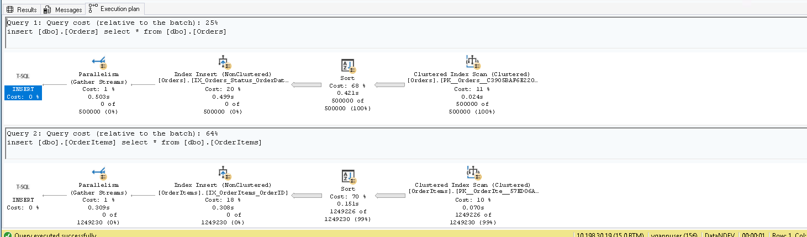
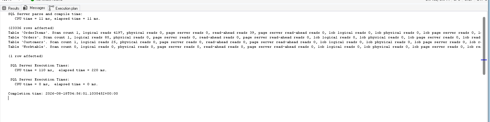
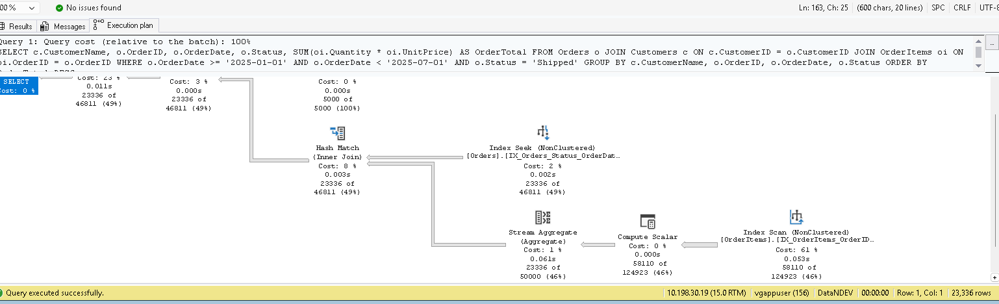
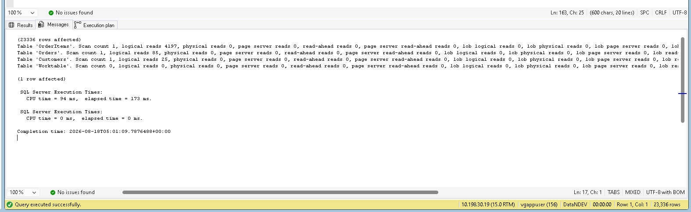

# Query Optimization Case Study: Order Reporting Query

**A reproducible before/after case study on diagnosing and fixing a slow order-reporting query — measured on SQL Server Express with SSMS: 52.7% faster (366 ms → 173 ms, a 2.1× speedup) and 96.2% fewer logical reads on the driving table, by fixing a non-SARGable predicate and adding two targeted indexes.**

## The Scenario

A common reporting request in order/warehouse systems:

> **"Show me all shipped orders in the first half of 2025, with customer name and order total, ranked highest value first."**

This type of report may be executed frequently by finance, operations, and customer service teams. As the underlying orders table grows, an inefficient query can gradually become slower and eventually impact report response times.

This case study demonstrates how to identify the bottleneck, optimize the query, and measure the improvement using SQL Server execution plans and `STATISTICS IO/TIME`.

## Reproducing This Yourself

Everything needed to reproduce this case study is available in [`warehouse_query_optimization.sql`](warehouse_query_optimization.sql).

The script contains the schema, data generation, baseline query, optimization, and performance measurements:

1. **Section 01** — Creates the database schema.
2. **Section 02** — Generates the dataset:

   * 5,000 customers
   * 500,000 orders covering a 2-year date range
   * Approximately 1.25 million order items
3. **Section 03** — Runs the baseline non-SARGable query with `SET STATISTICS IO/TIME ON`.
4. **Section 04** — Adds the two targeted indexes and runs the optimized query with the same statistics enabled.
5. **Section 05** — Provides a template for recording logical reads, CPU time, and elapsed time from your own execution.

Run the script from top to bottom in **SQL Server Management Studio (SSMS)** or **Azure Data Studio** against a scratch database.

No external dependencies are required.

---

## The Problem

The original query filtered orders by year and month using functions applied to the `OrderDate` column:

```sql
WHERE LEFT(CONVERT(VARCHAR(10), o.OrderDate, 120), 4) = '2025'
  AND MONTH(o.OrderDate) BETWEEN 1 AND 6
  AND o.Status = 'Shipped';
```

The query returns the correct results, but the predicate is **non-SARGable** because functions are applied to the indexed `OrderDate` column.

When a column is wrapped in functions, SQL Server cannot efficiently use that column to seek directly to the required date range. For this access pattern, this makes a scan much more likely.

### Before Optimization — Execution Plan

The actual execution plan was captured in SSMS using **Include Actual Execution Plan (Ctrl+M)**.

The `Orders` table is accessed using a **Clustered Index Scan**.




### Before Optimization — STATISTICS IO/TIME

The following measurements were captured using:

```sql
SET STATISTICS IO ON;
SET STATISTICS TIME ON;
```

| Table      | Logical Reads |
| ---------- | ------------: |
| Orders     |         2,245 |
| OrderItems |         5,270 |
| Customers  |            25 |

**CPU time:** 156 ms
**Elapsed time:** 366 ms



---

## The Fix

Two changes were made without changing the business logic or the result set.

### 1. Rewrote the Predicate to Be SARGable

Instead of applying functions to `OrderDate`, the query uses a direct date range:

```sql
WHERE o.OrderDate >= '2025-01-01'
  AND o.OrderDate < '2025-07-01'
  AND o.Status = 'Shipped';
```

This allows SQL Server to use the `OrderDate` portion of an appropriate index to efficiently identify the required date range.

Using an exclusive upper bound (`< '2025-07-01'`) also avoids time-of-day issues when `OrderDate` contains a time component.

### 2. Added Two Targeted Indexes

The indexes were designed around the query's filtering and joining requirements:

```sql
CREATE INDEX IX_Orders_Status_OrderDate
    ON Orders (Status, OrderDate)
    INCLUDE (CustomerID);

CREATE INDEX IX_OrderItems_OrderID
    ON OrderItems (OrderID)
    INCLUDE (Quantity, UnitPrice);
```

### Why This Column Order?

The `Orders` index is defined as:

```text
(Status, OrderDate)
```

* `Status` is used with an equality predicate, so it leads the composite index.
* `OrderDate` is used for the date range, so it follows `Status`.
* `CustomerID` is included because it is needed by the join but does not need to be part of the index key.

This allows SQL Server to use the index efficiently for the combination of the status filter and date range while also having `CustomerID` available without requiring an additional lookup for that column.

### After Optimization — Execution Plan

After the changes, the `Orders` table is accessed using an **Index Seek** on `IX_Orders_Status_OrderDate`.

Both the `Status` equality predicate and the `OrderDate` range predicate can be applied using the index.

For `OrderItems`, SQL Server uses an **Index Scan** on the narrower covering nonclustered index `IX_OrderItems_OrderID`.

This is expected for this query plan. The query does not first filter `OrderItems` to a small range of `OrderID` values; instead, SQL Server can scan the narrower covering index to obtain the required columns for the join and aggregation.

The important improvement is that the large `Orders` driving table is no longer accessed through a clustered index scan.



### After Optimization — STATISTICS IO/TIME

The same measurement method was used after optimization:

```sql
SET STATISTICS IO ON;
SET STATISTICS TIME ON;
```

| Table      | Logical Reads |
| ---------- | ------------: |
| Orders     |            85 |
| OrderItems |         4,197 |
| Customers  |            25 |

**CPU time:** 94 ms
**Elapsed time:** 173 ms


---

## Result

| Metric               |               Before |      After |                     Improvement |
| -------------------- | -------------------: | ---------: | ------------------------------: |
| Elapsed time         |               366 ms |     173 ms | **52.7% faster (2.1× speedup)** |
| CPU time             |               156 ms |      94 ms |                 **39.7% lower** |
| Orders logical reads |                2,245 |         85 |           **96.2% fewer reads** |
| Total logical reads  |                7,540 |      4,307 |           **42.9% fewer reads** |
| Orders access method | Clustered Index Scan | Index Seek |        **Improved access path** |

These measurements were captured from a local **SQL Server Express** instance using `SET STATISTICS IO/TIME ON` and SSMS's actual execution plan.

The exact elapsed time can vary depending on hardware, SQL Server configuration, data cache state, and system load. The logical-read reduction and execution-plan changes provide additional evidence of the optimization.

Full reproduction steps are available in [`warehouse_query_optimization.sql`](warehouse_query_optimization.sql).

---

## Skills Demonstrated

* T-SQL
* SQL Server Query Optimization
* SARGability / SARGable Predicate Design
* Execution Plan Analysis
* Index Seek vs. Index Scan
* Composite Index Design
* Composite Index Column Ordering
* Covering Indexes
* `INCLUDE` Columns
* `SET STATISTICS IO`
* `SET STATISTICS TIME`
* JOIN and `GROUP BY` Analysis
* Query Performance Benchmarking

---

## Why This Pattern Matters Beyond This Query

The performance impact of inefficient access patterns generally becomes more significant as tables grow.

On a 500K-row orders table, the difference is already measurable. On a multi-million-row orders table, repeatedly scanning a large table can consume substantially more I/O and CPU resources, especially when multiple users execute similar reports concurrently.

One useful first step when investigating a slow reporting query is to examine the execution plan and look for predicates that prevent efficient index usage, including functions applied directly to indexed columns.

This case study demonstrates that process:

**Identify the bottleneck → measure the baseline → make the predicate SARGable → design targeted indexes → measure again → validate the execution plan.**

---

## Project Structure

```text
sql-query-optimization-case-study/
│
├── warehouse_query_optimization.sql
├── before-execution-plan.png
├── after-execution-plan.png
├── before-statistics.png
├── after-statistics.png
└── README.md
```

---

*Schema and dataset were built specifically for this case study to demonstrate the diagnostic and optimization process using a realistic order/warehouse reporting scenario.*
